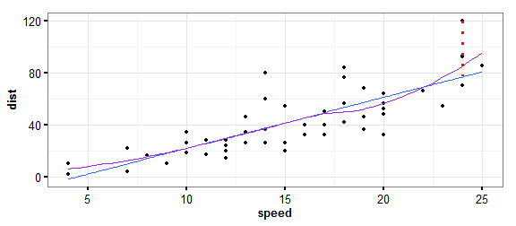
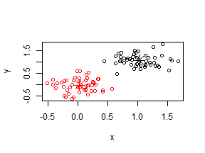
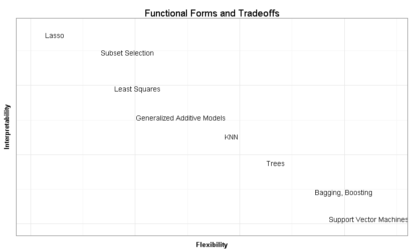
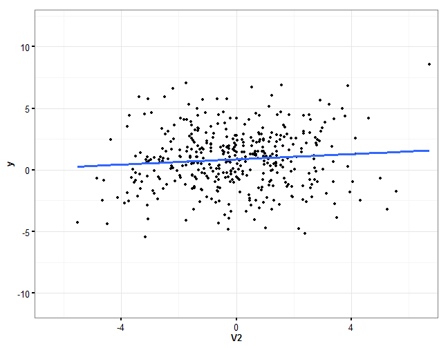
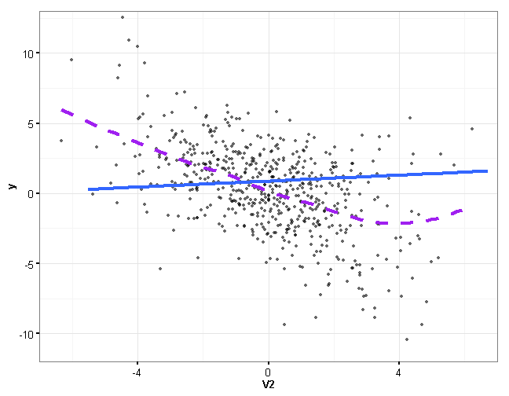
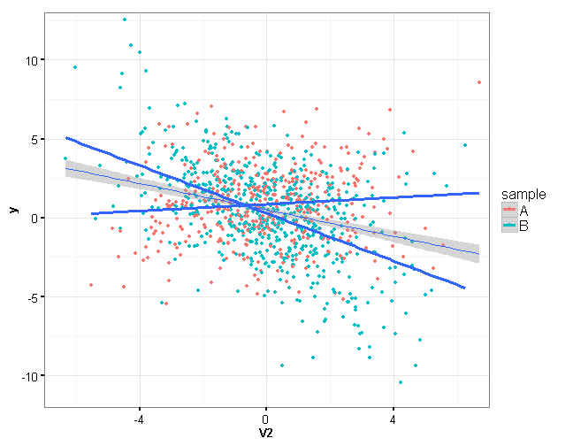

Applied Modeling Talk
========================================================
author: Jared Knowles
date: October, 2013

Do machines really learn?
========================================================

Applied modeling goes by many names: statistical learning, machine learning, and 
data mining. 

The key differences between applied modeling and statistical inference are:

- Emphasis on predictive validity
- De-emphasis on parameter values
- Test and training data
- Measures of fit

Applied Models and Inference
========================================================

Applied modeling and inferential statistics share many of the same concepts:

- Regression estimation
- Concerns about representative of data and samples
- Fear of outliers
- Robustness and sensitivity




Supervised vs. Unsupervised Learning
===========================================================

A key distinction in statistical learning is that between **supervised** and 
**unsupervised** techniques. 

- **supervised** - relationship between inputs and outputs is being explored
- **unsupervised** - the relationship among inputs is being explored, no output

We will focus on **supervised** learning for the most part in this talk. 




Statistical Modeling
=======================================================

It is useful to remember that in statistical modeling, in the **supervised** case, we are looking at the following relationship:

$$ \hat{Y} = \hat{f}(X) $$

In this case $\hat{f}$ represents our estimate of the function that links $X$ and 
$Y$. In traditional linear modeling, $\hat{f}$ takes the form:

$$ \hat{Y} = \alpha + \beta(X) + \epsilon $$

However, there exist limitless alternative $\hat{f}$ which we can explore. Applied modeling techniques help us expand the $\hat{f}$ space we search within.

How do we choose f?
===================================================

Choosing $f$ is about tradeoffs, the most obvious is between flexibility and 
interpretability.




Why the Difference?
========================================================

Applied Models:

- Provide information to users about what to expect given certain data
- Goals for the model are defined by the needs of the users

***

Inferential Models: 

- Seek to learn about the relationships in the data at hand
- Focused on understanding patterns in the current data


Some Vocabulary
========================================================

- Training data
- Test data


***

- Data the model is fit to
- Data the model is applied to, but not fit to, to evaluate model fit

The Challenge
=================================

- When using a statistical model to make predictions we have to think clearly 
about the data we use to build the model, and the data we will be making 
predictions about
- We may build a model with high **internal validity** for the data at hand, 
but that data may not be representative of the data the model will apply to
- We call this the **training error** and the **test error**
- In inferential statistics we often seek to reduce **training error** and not 
concern ourselves with **test error**


A Trivial Example
===============================

Consider the following:


```r
library(MASS)
library(Matrix)
set.seed(1814)
N <- 1000
J <- 4 ### Number of predictors (including intercept)
G <- 5 ### Number of Multilevel Groups
X <- matrix(rnorm(N,0,1),N,J); X[,1] <- 1
Sigma <- matrix(runif(J*J,-1,1),J,J)
Sigma <- nearPD(Sigma)$mat
diag(Sigma) <- runif(J,1,5)
gamma <- runif(J,-.25,.25)
beta <- matrix(NA,G,J)
for (g in 1:G) {beta[g,] <- mvrnorm(1, gamma, Sigma)}
m <- sample(1:G, N, replace=TRUE) ### Multilevel group indicator
y <- rowSums(beta[m,] * X) + rnorm(N,0,1.4)

plotdf <- cbind(X, m, y)
plotdf <- as.data.frame(plotdf)

mod1 <- lm(y ~ V2 + V3 + V4 + factor(m), data=plotdf[plotdf$m>3,])
mod2 <- lm(y ~ V2 + V3 + factor(m), data=plotdf[plotdf$m<=3,])

mod1.plot <- fortify(mod1)
mod2.plot <- fortify(mod2)

plotdf$sample <- NA
plotdf$sample[plotdf$m>3] <- "A"
plotdf$sample[plotdf$m<=3] <- "B"


qplot(V2, y, data=plotdf[plotdf$m>3,]) + 
  geom_smooth(data=mod1.plot, aes(x=V2, y=.fitted), se=FALSE, size=I(1.1)) +
  theme_dpi()
```

 


Consider the Test Data
=========================


```r
qplot(V2, y, data=plotdf[plotdf$m<=3,]) + 
  geom_smooth(data=mod2.plot, aes(x=V2, y=.fitted), se=FALSE, size=I(1.1)) +
  theme_dpi()
```

 


Consider the Pooled Data
==========================


```r
qplot(V2, y, data=plotdf, color=sample) + geom_smooth(method=lm, aes(group=1))+
  geom_smooth(data=mod1.plot, aes(x=V2, y=.fitted, color=NULL), 
              se=FALSE, size=I(1.1)) +  
     geom_smooth(data=mod2.plot, aes(x=V2, y=.fitted, color=NULL), 
              se=FALSE, size=I(1.1)) + theme_dpi()
```

 

```r

```

