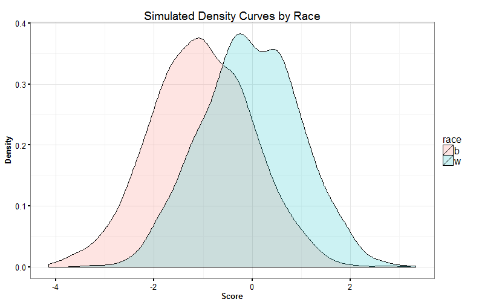
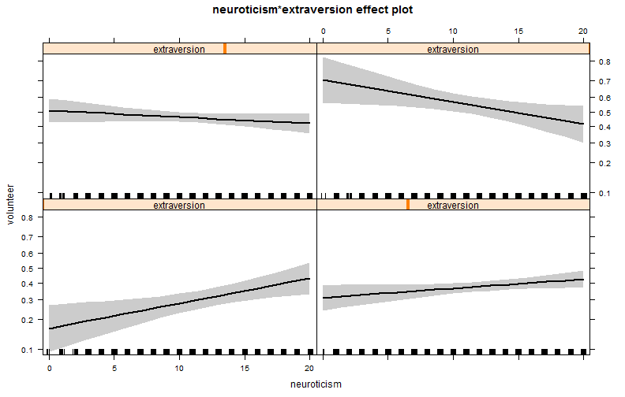
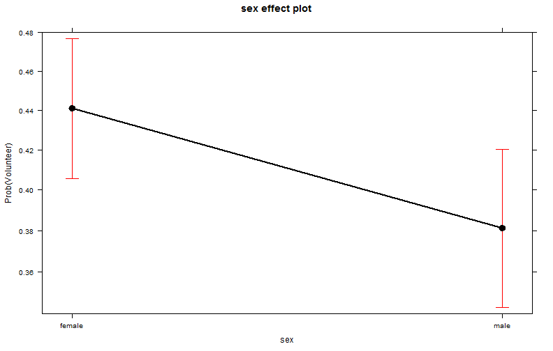
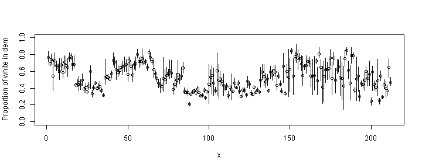
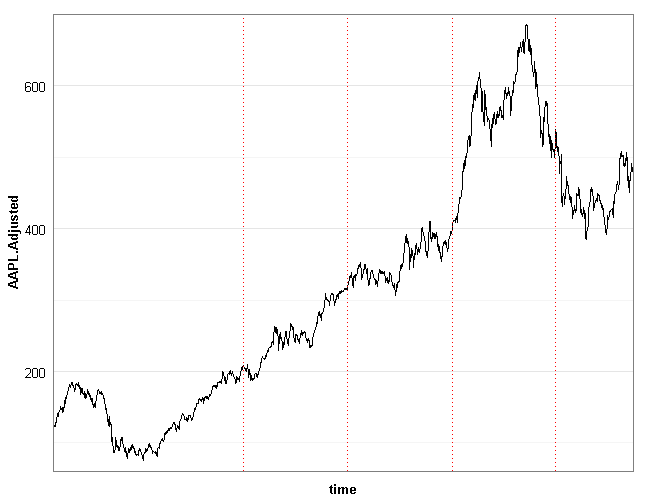
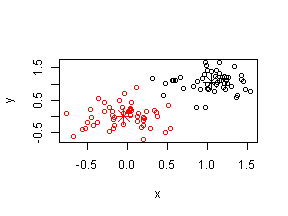

<style>

body, p, td, li, div {
  font-size: 18pt;
  color: white;
}

h1,h2,h3,h4,h5,h6 {
	text-shadow: 0 0 0 #000 !important;
  color: white;
}

.reveal pre {   
  margin-top: 0;
  max-width: 95%;
  border: 1px solid #ccc;
  white-space: pre-wrap;
  margin-bottom: 1em; 
  color: black;
}

.reveal a:not(.image) {
  color: red;
  text-decoration: none;
  -webkit-transition: color .15s ease;
  -moz-transition: color .15s ease;
  -ms-transition: color .15s ease;
  -o-transition: color .15s ease;
  transition: color .15s ease; }

.reveal a:not(.image):hover {
  color: #0000f1;
  text-shadow: none;
  border: none; }

.reveal .roll span:after {
  color: #fff;
  background: #00003f; }

.reveal pre code {
  display: block; padding: 0.5em;
  font-size: 1.6em;
  line-height: 1.1em;
  background-color: white;
  overflow: visible;
  max-height: none;
  word-wrap: normal;
  color: black;
}
.reveal .state-background {
  background: black;
} 

.reveal section p {
  color: white;
}

.reveal section h1 {
  color: white;
}

.reveal section h2 {
  color: white;
}

.reveal section h3 {
  color: white;
}

</style>

Using Statistical Models to Help Policymakers Avoid Mistakes
========================================================
author: Jared Knowles
date: October 23, 2013

Overview
===============

- What mistakes do policymakers make?
- What tools can be used to avoid them?
- How do you make the case to avoid these mistakes?
- Your toolkit needs to be broad to meet policymakers needs

Mistakes We Knew We Were Making
======================================

Three vignettes will serve to ground our discussion on common mistakes in 
the policy world using data. No policymaker is immune to making any of these 
mistakes and even trained analysts can, do, and will make them.

1. The case of the simple mean
2. Why rates are always leading us astray?
3. Applying models improperly


Problems with the mean
========================

1. The mean is uninformative because it masks conditional variation
2. The mean invites overinterpretation too often
3. The mean too often substitutes important facts about the rest of the distribution

Expecting and presenting only the mean masks too much heterogeneity and too much 
important variability to invite systemic or productive analysis. 

The Mean is Uninformative
============================

Gap

- Black-white gap is 1 standard deviation
- Economic disadvantage gap is 1 standard deviation
- SwD gap is 1.2 standard deviations

***

Alternative hypothesis

- Black students are more likely to be poor
- Poor students are more likely to be black
- Disabled students are more likely to be black or poor

The Mean is Misinterpreted
=============================

Gap

- Black-white gap is 1 standard deviation
- Economic disadvantage gap is 1 standard deviation
- SwD gap is 1.2 standard deviations

***

Alternative: 

- All black students underperform white students
- Economically disadvantaged students do not score highly on tests
- Having any disability drastically reduces your student performance


The Mean Masks too Much
===================================

Gap

- Black-white gap is 1 standard deviation
- Economic disadvantage gap is 1 standard deviation
- SwD gap is 1.2 standard deviations

***

Hidden facts: 

- In some schools a white-black gap exists
- Some economically disadvantaged students are indistinguishable from their peers
- Some disability types outperform students without disabilities

The Kicker
===========================

Students who are black, economically disadvantaged, and disabled have much worse 
student outcomes than would ever be considered from the statistics above. 

Students who are white, economically disadvantaged, and disabled have much better 
outcomes than their black peers. 

These facts cannot be uncovered by simple means. 

An Aside on Skew
=============================


Tools to Address the Mean Problem
===========================================

- Data visualizations
- Conditional probability models
- Discussions




Plot The Effects
=========================



Plot The Effects: Categorical
==============================



Problems with the rate
========================

1. The rate is not robust in small groups
2. The rate masks uncertainty
3. The rate does not provide a proper sense of inertia

Rates are often turned to when wishing to explain the differences between areas 
with different group sizes. This can be misused and cause bad policy responses. 


Graduation rates
=========================

Exercise: Describe a school district with the lowest graduation rate in 
your favorite state. 


Graduation rates
=========================

What features did you use to describe it? 

1. High poverty
2. High minority
3. Large urban core?

In Wisconsin the lowest graduation rate in the state belongs to a district with 
under 250 students in a graduating class. 

Only **103** out of **228** students in Grantsburg graduated in 2011-12. 

Two Comments and a Question
===============================

1. If Grantsburg graduated 50 more students in a year, it would move past several 
other districts in the state. 

2. If MPS graduated 500 less students in a year, it still would not fall below 
Grantsburg. 

Is it fair to rank Grantsburg below Milwaukee? It probably depends!

Fragility of Rates
======================

Consider Prentice. 


The Problem
====================

1. Is Prentice above or below average?
2. What will Prentice's rate be next year?
3. How easy is it to move the rate?

And all of these problems are if we ignore the problems about unconditional 
probabilities we have already discussed!

Applicability
==========================

This is why ranking systems are suspect rating period to rating period. Simply 
reporting the rate provides no underlying sense of the variability in the measure and 
without also reporting the *n* count, there is no way to interpret the findings. 

If you work in policy you will be asked to report means and rates all the time. 

You will be asked to construct rankings and indexes all the time. 

Tread carefully!

Solutions
=============

1. Present rates with robustness by simulating change in rate with change in 
unit level 
2. Conduct ecological inference on group data to infer probabilities for 
individual units with uncertainty
3. Use Bayesian methods to pool across groups and appropriately estimate uncertainty for small groups, and certainty for large groups

Solutions - Quick and Easy
==============================

For repeated measures we can report the rate with "fragility" by showing the 
range if 3 or 4 more students graduated or did not graduate.


Solutions - Ecological Inference
=============================

Without individual level data, we can use something called *ecological 
inference* to try to understand the probability of individual behavior. 


```r
library(eiPack)
data(senc); senc$names <- paste(senc$county, senc$precinct, sep="-")
print(head(senc[, 2:7],2))
```

```
  precinct total white black natam  dem
1  ABBOTTS   490   355   134     1  399
2   BETHEL  1729  1497   224     8 1238
```


Solutions - Graphical EI
==========================


```r
myEI.MD <- ei.MD.bayes(cbind(dem, rep, non) ~ cbind(black, white, natam), 
                       data=senc)
par(bg = "white")
cover.plot(myEI.MD, row="white", column="dem", bg="white")
```




Solutions - Complex and More Useful
=====================================

Statistical models that correct for small group bias and draw information 
from other sources.

[The Radon Project](http://www.stat.columbia.edu/~radon/index.html)

- An online calculator to assess your localized risk for radon based on three factors

1. The estimated countywide probability of severe radon exposure in your area
2. The updated estimate based on test results of nearby neighbors (self-reported)
3. Updated estimate based on 1, 2, and your own home test. 

All weighted by your tolerance for risk and other factors


What is a model?
===============================

- An abstraction from reality
- What features does it have?
- What purpose does it serve?
- Who will use it?


Is this  a model?
===============================


Goals for This Section
========================================================

1. Introduce the world of statistical models outside of 
linear models
2. Demonstrate the specific techniques around building predictive models
3. Discuss the tradeoffs in applied vs. research models


What is a statistical model?
===============================

- "All models are wrong, some models are useful"
- Being wrong is a **feature of a statistical model**, the goal is to explain 
as much data as possible with as few variables as possible
- Statistical models are mathematical summaries of correlations and probabilities 
of known data
- The most common form is the linear regression model


Do machines really learn?
========================================================

Applied modeling goes by many names: statistical learning, machine learning, 
predictive analytics, and data mining. 

The key differences between applied modeling and statistical inference are:

- Emphasis on predictive validity for non-sample data
- De-emphasis on parameter values in favor of prediction
- Techniques of evaluating test and training data to balance error and variance 
bias
- Explicit confrontation with trade-offs between flexibility and interpretability


Applied Models and Inference
========================================================

Applied modeling and inferential statistics share many of the same concepts:

- Regression estimation
- Concerns about representativeness of data and samples
- Fear of outliers
- Checks on robustness and sensitivity


Statistical Modeling
=======================================================

It is useful to remember that in statistical modeling, in the **supervised** case, we are looking at the following relationship:

$$ \hat{Y} = \hat{f}(X) $$

In this case $\hat{f}$ represents our estimate of the function that links $X$ and 
$Y$. In traditional linear modeling, $\hat{f}$ takes the form:

$$ \hat{Y} = \alpha + \beta(X) + \epsilon $$

However, there exist limitless alternative $\hat{f}$ which we can explore. Applied modeling techniques help us expand the $\hat{f}$ space we search within.

How do we choose f?
===================================================

Choosing $f$ is about tradeoffs, the most obvious is between flexibility and 
interpretability.


Why the Difference?
========================================================

Applied Models:

- Provide information to users about what to expect given certain data
- Serve many goals including prediction of non-observed 
outcomes, summarizing large datasets, measuring uncertainty
- Goals for the model are defined by explicit tradeoffs

***

Inferential Models: 

- Focused on understanding patterns in the current data
- Seek to understand how current data extrapolates to a population
- Estimates population parameters from sample data to inform on relationships


Some Vocabulary
========================================================

- Training data
- Test data
- Bias (error)
- Variance (error)


***

- Data the model is fit to
- Data the model is applied to, but not fit to, to evaluate model fit
- Refers to the amount of error due to simplifying a complex process
- The amount the $f$ would change if fit to a different training set of data


The Challenge
=================================

- When using a statistical model to make predictions we have to think clearly 
about the data we use to build the model, and the data we will be making 
predictions about
- We may build a model with high **internal validity** for the data at hand, 
but that data may not be representative of the data the model will apply to
- We call this the **training error** and the **test error**
- In inferential statistics we often seek to reduce **training error** and not 
concern ourselves with **test error**
- In applied modeling we focus on finding the optimal tradeoff between **variance error** and **bias error** 


When Could this Matter: Stocks?
=================================




Forecasting Apple Stock Could be Useful
===========================================

- Fit a model on the earlier part of the data (in blue)


Forecasts Are Tricky
========================

- Fit another model on the middle part of the data (purple)


The Further We Get From The Training Data...
================================================

- Test both models on the full data!


Overfit
=====================

- Training data can lead to model overfit (the blue line)
- Training data can lead to bias in future predictions (the purple line)
- We need both methods of $f$ and methods of evaluating models that 
can insulate against overfit
- This means different measures of model fit to choose among competing models
- Understanding the data generation process helps inform how difficult extrapolation will be
- Time changes everything and the process/logic of updating models is important
- Non-linear behaviors can be right around the corner
- Paradigm shifts occur


Measuring Fit Differently
=============================

- Classification measures like ROC
- Mean Squared Error for the test data
- Repeated folds, cross-validation, LOOCV
- All ways to deal with robustly choosing a model that might fit the training 
data less optimally, but it likely to be a better fit on future data


Takeaways
================

- Linear modeling and regression is just one of many choices of modeling data
- Model fit within the data may not provide reliable or useful results outside 
of the data
- Different problems call for different statistical modeling techniques
- These techniques include different functional forms, different measures of 
model fit, and different ways of classifying successful models
- Models are tools to understand complex relationships


Keep an open mind
===============================

- K Nearest Neighbors


Further Resources
====================

- The Signal and the Noise: Why So Many Predictions Fail — but Some Don't. Nate Silver. (2012). Penguin.
- The Black Swan: Second Edition: The Impact of the Highly Improbable (2nd ed. 2010). Nassim Taleb.  Random House.
- An Introduction to Statistical Learning (2013). Gareth James, Daniela Witten, Trevor Hastie and Robert Tibshirani. Springer. 
- Elements of Statistical Learning (Second Edition, 2011). Trevor Hastie, 
Robert Tibshirani, and Jerome Friedman. Springer


Supervised vs. Unsupervised Learning
===========================================================

A key distinction in statistical learning is that between **supervised** and 
**unsupervised** techniques. 

- **supervised** - relationship between inputs and outputs is being explored
- **unsupervised** - the relationship among inputs is being explored, no output

We will focus on **supervised** learning for the most part in this talk. 



