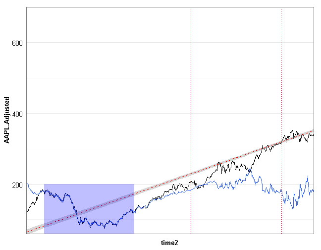
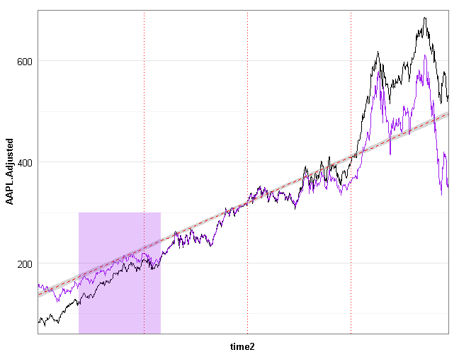
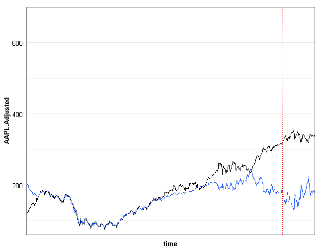
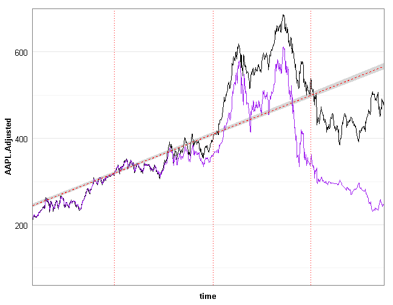
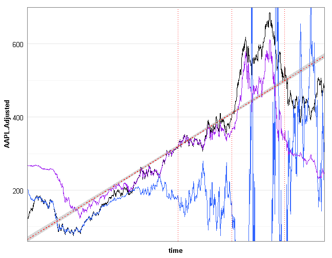

Applied Modeling Talk
========================================================
author: Jared Knowles
date: October, 2013

Overview
===============

- What are statistical models?
- What is applied modeling?
- What to keep in mind?
- Why is this important?

What is a model?
===============================

- An abstraction from reality
- What features does it have?
- What purpose does it serve?

Is this  a model?
===============================

What is a statistical model?
===============================

- "All models are wrong, some models are useful"
- Being wrong is a **feature of a statistical model**, the goal is to explain 
as much data as possible with as few variables as possible
- Statistical models are mathematical summaries of correlations and probabilities
- The most common form is linear regression models

Do machines really learn?
========================================================

Applied modeling goes by many names: statistical learning, machine learning, and 
data mining. 

The key differences between applied modeling and statistical inference are:

- Emphasis on predictive validity
- De-emphasis on parameter values
- Test and training data
- Measures of fit

Goals for This Talk
========================================================

1. Introduce the world of statistical models outside of 
linear models
2. Demonstrate the specific techniques around building predictive models
3. Discuss the tradeoffs in applied vs. research models
4. Show some R code!

Applied Models and Inference
========================================================

Applied modeling and inferential statistics share many of the same concepts:

- Regression estimation
- Concerns about representativeness of data and samples
- Fear of outliers
- Robustness and sensitivity

Supervised vs. Unsupervised Learning
===========================================================

A key distinction in statistical learning is that between **supervised** and 
**unsupervised** techniques. 

- **supervised** - relationship between inputs and outputs is being explored
- **unsupervised** - the relationship among inputs is being explored, no output

We will focus on **supervised** learning for the most part in this talk. 

Statistical Modeling
=======================================================

It is useful to remember that in statistical modeling, in the **supervised** case, we are looking at the following relationship:

$$ \hat{Y} = \hat{f}(X) $$

In this case $\hat{f}$ represents our estimate of the function that links $X$ and 
$Y$. In traditional linear modeling, $\hat{f}$ takes the form:

$$ \hat{Y} = \alpha + \beta(X) + \epsilon $$

However, there exist limitless alternative $\hat{f}$ which we can explore. Applied modeling techniques help us expand the $\hat{f}$ space we search within.

How do we choose f?
===================================================

Choosing $f$ is about tradeoffs, the most obvious is between flexibility and 
interpretability.

Why the Difference?
========================================================

Applied Models:

- Provide information to users about what to expect given certain data
- Goals for the model are defined by the needs of the users

***

Inferential Models: 

- Seek to learn about the relationships in the data at hand
- Focused on understanding patterns in the current data

Some Vocabulary
========================================================

- Training data
- Test data
- Bias (error)
- Variance (error)

***

- Data the model is fit to
- Data the model is applied to, but not fit to, to evaluate model fit
- Refers to the amount of error due to simplifying a complex process
- The amount the $f$ would change if fit to a different training set of data

The Challenge
=================================

- When using a statistical model to make predictions we have to think clearly 
about the data we use to build the model, and the data we will be making 
predictions about
- We may build a model with high **internal validity** for the data at hand, 
but that data may not be representative of the data the model will apply to
- We call this the **training error** and the **test error**
- In inferential statistics we often seek to reduce **training error** and not 
concern ourselves with **test error**

A Trivial Example
===============================

Consider the following training data:

Consider the Test Data
=========================

How does our model fit the test data? 

Consider the Pooled Data
==========================

What do we learn?
=============================

- The data was generated from the same function but there was a trend across 
groups
- Predicting from this training model leads to **bias** in our predictions
- The relationship among the groups iteratively shifted, so data earlier in 
the process understated the effect coming later
- These out of sample differences are what make forecasting tricky
- Traditional methods rely on sampling to do this
- How do we protect ourselves in the case when we can't sample the data we want 
to predict because it hasn't been generated yet? 

When Could this Matter: Stocks?
=================================

Forecasting Apple Stock Could be Useful
===========================================

Forecasts Are Tricky
========================

The Further We Get From The Training Data...
================================================

Overfit
=====================

- Training data can lead to model overfit
- We need both methods of **f** and methods of evaluating models that 
can insulate against overfit
- This means different measures of model fit
- Extrapolation gets harder
- Time changes everything
- Non-linear behaviors
- Paradigm shifts

Measuring Fit Differently
=============================

- Classification measures
- Mean Squared Error
- Folding, cross validation, and other methods of measuring error

Resources
====================

- An Introduction to Statistical Learning (2013). Gareth James, Daniela Witten, Trevor Hastie and Robert Tibshirani. Springer. 
- Elements of Statistical Learning (Second Edition, 2011). Trevor Hastie, 
Robert Tibshirani, and Jerome Friedman. Springer
