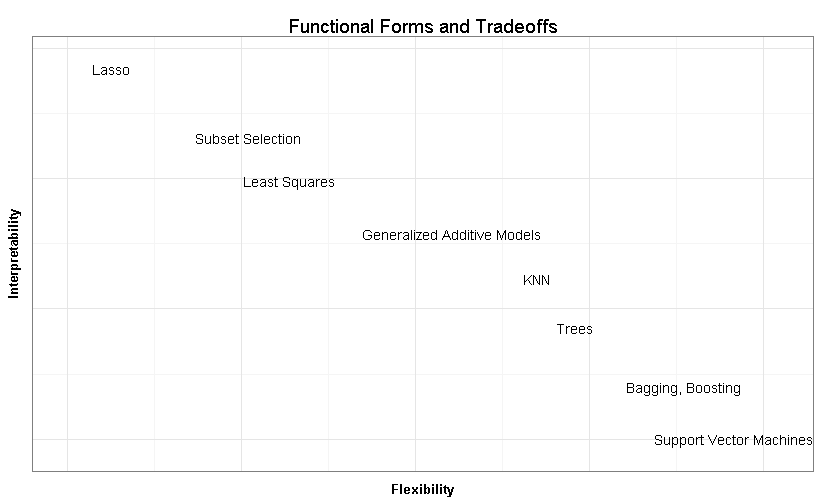

Applied Modeling Talk
========================================================
author: Jared Knowles
date: October, 2013

Do machines really learn?
========================================================

Applied modeling goes by many names: statistical learning, machine learning, and 
data mining. 

The key differences between applied modeling and statistical inference are:

- Emphasis on predictive validity
- De-emphasis on parameter values
- Test and training data
- Measures of fit

Applied Models and Inference
========================================================

Applied modeling and inferential statistics share many of the same concepts:

- Regression estimation
- Concerns about representative of data and samples
- Fear of outliers
- Robustness and sensitivity

Supervised vs. Unsupervised Learning
===========================================================

A key distinction in statistical learning is that between **supervised** and 
**unsupervised** techniques. 

- **supervised** - relationship between inputs and outputs is being explored
- **unsupervised** - the relationship among inputs is being explored, no output

We will focus on **supervised** learning for the most part in this talk. 

Statistical Modeling
=======================================================

It is useful to remember that in statistical modeling, in the **supervised** case, we are looking at the following relationship:

$$ \hat{Y} = \hat{f}(X) $$

In this case $\hat{f}$ represents our estimate of the function that links $X$ and 
$Y$. In traditional linear modeling, $\hat{f}$ takes the form:

$$ \hat{Y} = \alpha + \beta(X) + \epsilon $$

However, there exist limitless alternative $\hat{f}$ which we can explore. Applied modeling techniques help us expand the $\hat{f}$ space we search within.

How do we choose f?
===================================================

Choosing $f$ is about tradeoffs, the most obvious is between flexibility and 
interpretability.

Why the Difference?
========================================================

Applied Models:

- Provide information to users about what to expect given certain data
- Goals for the model are defined by the needs of the users

***

Inferential Models: 

- Seek to learn about the relationships in the data at hand
- Focused on understanding patterns in the current data

Some Vocabulary
========================================================

- Training data
- Test data

***

- Data the model is fit to
- Data the model is applied to, but not fit to, to evaluate model fit
