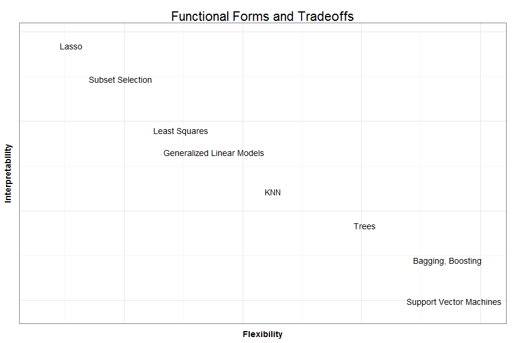

<style>

body, p, td, li, div {
  font-size: 18pt;
  color: white;
}

h1,h2,h3,h4,h5,h6 {
        text-shadow: 0 0 0 #000 !important;
  color: white;
}

.section .reveal .state-background {
   background: black;
}

span.centerImage {
     text-align: center;
}
.section .reveal h2,
.section .reveal h3,
.section .reveal p {
   color: white;
   margin-top: 50px;
}


.reveal blockquote {
  background: black;
  border-left: 10px solid #ccc;
  margin: 1.5em 10px;
  padding: 0.5em 10px;
  quotes: "\201C""\201D""\2018""\2019";
}

.reveal section del {
  color: red;
}

blockquote:before {
  color: #ccc;
  content: open-quote;
  font-size: 4em;
  line-height: 0.1em;
  margin-right: 0.25em;
  vertical-align: -0.4em;
}

blockquote p {
  display inline;
}

.reveal pre {   
  margin-top: 0;
  max-width: 95%;
  border: 1px solid #ccc;
  white-space: pre-wrap;
  margin-bottom: 1em; 
  color: black;
}

.reveal a:not(.image) {
  color: red;
  text-decoration: none;
  -webkit-transition: color .15s ease;
  -moz-transition: color .15s ease;
  -ms-transition: color .15s ease;
  -o-transition: color .15s ease;
  transition: color .15s ease; }

.reveal a:not(.image):hover {
  color: #0000f1;
  text-shadow: none;
  border: none; }

.reveal .roll span:after {
  color: #fff;
  background: #00003f; }

.reveal pre code {
  display: block; padding: 0.5em;
  font-size: 1.6em;
  line-height: 1.1em;
  background-color: white;
  overflow: visible;
  max-height: none;
  word-wrap: normal;
  color: black;
}
.reveal .state-background {
  background: black;
} 

.reveal section p {
  color: white;
}

.reveal section h1 {
  color: white;
}

.reveal section h2 {
  color: white;
}

.reveal section h3 {
  color: white;
}

</style>

<script type="text/x-mathjax-config">
  MathJax.Hub.Config({
    "HTML-CSS": { scale: 100}
  });
</script>

Statistical Learning and Applied Modeling in Education
========================================================
Examples and Concerns
------------------------------------------------------

## **Jared Knowles**
## **01-31-2014**

Motivation
===================================================
incremental: true

- Of the two modeling cultures, we've tend to focus overwhelmingly on one
- Computation increases are changing everything
- Data is growing and many problems have different issues
- Prediction is underused and undervalued, and this undermines inference

Some Trends
======================================================

- Available data in education is growing astronomically. 
- Schools are increasingly being asked to provide more services. 
- Policy makers increasingly asked to justify their policies with projections. 
- Timelines are speeding up!
- People are talking about things like "data science" and "big data" (even NSF)
- Academics have to explain their work to a growing list of stakeholders. 

Computers
=====================================================

- Most of your statistics books were written by people who used this:


- We will be working in an era unlike all previous generations of statisticians -- 
computers are going to continually get better and better at solving problems
- The high cost of computation constrains our thinking and our methods now, just 
like it did for the last two hundred years

Unparalleled Increase in Computation Leads to Different Solutions
======================================================================


<small>Now we can bootstrap, use MCMC for Bayesian methods, and do multi-model inference 
in a fraction of the time</small>

Outline
=====================================================

- What is a modeling culture and how can there be two?
- Why should we pay more attention to model fit?
- What changes when we apply a model beyond the journal article? 
- Rules of thumb, practical advice, and communication


What is a model?
===============================


What is a statistical model?
===============================

- "All models are wrong, some models are useful" ~ George Box
- Statistical models are mathematical summaries of correlations and probabilities 
of known data
- Being wrong is a **feature of a statistical model**, the goal is to explain 
as much data as possible with as few variables as possible
- The most common in the social sciences is the linear regression model
- Sometimes the goal is **inference** and other times it is **prediction**
- In statistical learning we can think of **supervised** and **unsupervised** cases

Statistical Modeling
=======================================================

It is useful to remember that in all statistical modeling, in the **supervised** case, we are looking at the following relationship:

$$ \hat{Y} = \hat{f}(X) $$

In this case $\hat{f}$ represents our estimate of the function that links $X$ and 
$Y$. In traditional linear modeling, $\hat{f}$ takes the form:

$$ \hat{Y} = \alpha + \beta(X) + \epsilon $$

However, there exist limitless alternative $\hat{f}$ which we can explore. Applied modeling techniques help us expand the $\hat{f}$ space we search within.


The Data Modeling Culture
=================================

- Starts philosophically with the idea that we have written down a set of X that 
describe Y with a known functional form that we are testing
- Black box between x and y can be known because the data generating process 
DGP is some functional combination of predictors, parameters, and noise
- Model fit is based on goodness of fit and residual tests


The Algorithmic Modeling Culture
========================================

- Black box is unknowable - we are not modeling nature but seeking to use similar 
inputs to predict the outputs of the natural process
- Model fit measured by prediction accuracy


Gelman on Being a Modeling Pluralist
==========================================

> Schools of statistical thoughts are sometimes jokingly likened to religions. This analogy is not perfect—unlike religions, statistical methods have no supernatural content and make essentially no demands on our personal lives. Looking at the comparison from the other direction, it is possible to be agnostic, atheistic, or simply live one’s life without religion, but it is not really possible to do statistics without some philosophy. ~ Andrew Gelman


Functional forms
==============================




<small>Figure adapted from James et al. 2013 (figure 2.7)</small>

Statistical Learning or Statistical Inference?
=================================================================

The line between statistical learning and statistical inference has always been 
blurry and unclear. A few questions can help:
<small>
- Am I interested in accurately estimating unobserved observations based on what 
I have learned in my sample?
- Am I interested in the relationships among the parameters in my sample because 
of a theory I am testing, or because of how they can explain an outcome I am 
interested in?
- Is the data I am using common and relatively untransformed? Will new data be 
created regularly that I can fit the same model to and update?
</small>

Predicting Dropout
=====================================================

Applied Model:
<small>
- Data: Common, transactional, regularly collected at specific timepoints
- Many cohorts with common data
- Interested in learning which students today are likely to dropout in the future
- Want: Confident predictions on likely graduation of new students, used to decide how
to allocate resources and services to students
</small>

***

Inferential Model:
<small>
- Data: national survey data, unlikely to be collected on future observations 
- One cohort is followed in the data set
- Interested in learning if social and emotional concerns are more important than 
academic success in predicting graduation
- Want: unbiased and precise estimates of parameters and if possible ability to make 
causal claims
</small>

Why the Difference?
========================================================

Algorithmic Models:

- Provide information to users about what to expect given certain data
- Serve many goals including prediction of non-observed 
outcomes, summarizing large datasets, measuring uncertainty
- Goals for the model are defined by explicit tradeoffs

***

Data Models: 

- Focused on understanding patterns in the current data
- Seek to understand how current data extrapolates to a population
- Estimates population parameters from sample data about relationships between 
inputs and outputs


Some Vocabulary
========================================================

- Training data
- Test data
- Bias (error)
- Variance (error)


***

- Data the model is fit to
- Data the model is applied to, but not fit to, to evaluate model fit
- Refers to the amount of error due to simplifying a complex process
- The amount the $f$ would change if fit to a different training set of data


The Challenge
=================================

- When using a statistical model to make predictions we have to think clearly 
about the data we use to build the model, and the data we will be making 
predictions about
- We may build a model with high **internal validity** for the data at hand, 
but that data may not be representative of the data the model will apply to
- We call this the **training error** and the **test error**
- In inferential statistics we often seek to reduce **training error** and not 
concern ourselves with **test error**
- In applied modeling we focus on finding the optimal tradeoff between **variance** and **bias** 
in order to hopefully reduce **test error**

Tukey on Models
====================

> Since no model is to be believed in, no optimization for a single model can offer more than distant guidance. What is needed, and is never more than approximately at hand, is guidance about what to do in a sequence of ever more realistic situations. The analyst of data is lucky if he [or she] has some insight into a few terms of this sequence, particularly those not yet mathematized. ~ John W. Tukey


A Simple Motivating Example
=================================
When Could this Matter: Stocks?
=================================


Forecasting Apple Stock Could be Useful
===========================================

- Fit a model on the earlier part of the data (in blue)


Forecasts Are Tricky
========================

- Fit another model on the middle part of the data (purple)


Evaluating Model Fit
==================================================

How do we know how well our models fit? A **very brief** model comparison review:

- $\\R^2$ - ratio of explained variation to total variation (generally)
- Nested model tests: 
  * F test and Likelihood ratio tests (restricted and unrestricted model)
- Same sample tests:  
  * AIC, BIC, etc. (different penalties for model parameters)
- These don't give us a sense of how the model will do on **new** data, and they 
are not easy to explain!


Predicting New Data
================================================

- Test both models on the full data!


The Bias - Variance Tradeoff
=============================================

- The purple and blue models are identical except each was "trained" on different 
data, the difference between their predictions is **variance**
- Both have the less bias on the data they are trained, but the linear model 
  has a different bias - a feature of the flexibility in the model
- Less flexible models like linear models will have more bias, but are less 
variable in response to the data they are trained on


Model fit = Fit to signal + fit to noise
============================================

- Training data (sample) can lead to model overfit (the blue line)
- Training data can lead to bias in future predictions (the purple line)
- We need both methods of $f$ and methods of evaluating models that 
can insulate against overfit
- This means different measures of model fit to choose among competing models
- Time changes everything and the process/logic of updating models is important
- Non-linear behaviors can be right around the corner
- Paradigm shifts occur


Bias, Variance, Training, and Test Data
======================================

<small>Figure from Hastie, Tibshirani and Friedman (2009). Springer-Verlag (Figure 7.1) </small>


Measuring Fit Differently
=============================

- The more complex the model gets, the more it overfits the training data at the 
cost of the test data!
- Need to estimate the error on the test data set
- Need to choose an error measure: prediction error, mean squared error, etc. 
- Identify the method that is most appropriate: Repeated folds, cross-validation, LOOCV
- All ways to deal with robustly choosing a model that might fit the training 
data less optimally, but it likely to be a better fit on future data

Splitting the Data
============================

- In cases where observations are cheap, 50% of the sample is for training, 25% 
for validation, and 25% for final testing
- When data is not cheap, a number of methods can be used to approximate the 
test set error
- We are familiar with in-sample error estimates such as AIC, BIC, etc.
- K fold cross-validation splits the data into 5 groups, and uses each group 
1 time as a validation set, fitting the model to the other 4 groups
  *  "Overall, <U+FB01>ve- or tenfold cross-validation are recommended as a good compromise: see Breiman and Spector (1992)
and Kohavi (1995)." Hastie et al p. 243
- Bootstrap

Confusion Matrix
======================
<table>
  		<tr>
				<td colspan="2" rowspan="2"></td>
				<td colspan="2" style="background-color:#1b85b8; border: 2px solid #aaa">Actual</td>			
			</tr>
			<tr>
				<td>Negative</td>
				<td>Positive</td>
			</tr>
			<tr>
				<td rowspan="2" style="background-color:#ae5a41; border: 2px solid #aaa">Predicted</td>
				<td>Negative</td>
				<td><b>a</b></td>
				<td><b>b</b></td>
			</tr>
			<tr>
				<td>Positive</td>
				<td><b>c</b></td>
				<td><b>d</b></td>
			</tr>
		</table>
    
Some performance metrics we can use:
- Accuracy: $\frac{(a+d)}{(a+b+c+d)}$
- Precision (positive predictive value) = $\frac{a}{(a+b)}$
- Sensitivity (recall) = $\frac{a}{(a+c)}$
- Specificity (negative predictive value) = $\frac{d}{(b+d)}$
- False alarm (1-specificity) = $\frac{b}{(b+d)}$

Confusion Matrix
======================
<table>
      <tr>
				<td colspan="2" rowspan="2"></td>
				<td colspan="2" style="background-color:#1b85b8; border: 2px solid #aaa">Actual</td>			
			</tr>
			<tr>
				<td>Negative</td>
				<td>Positive</td>
			</tr>
			<tr>
				<td rowspan="2" style="background-color:#ae5a41; border: 2px solid #aaa">Predicted</td>
				<td>Negative</td>
				<td  style="background-color:#c3cb71; border: 2px solid #ead61c"><b>a</b></td>
				<td><b>b</b></td>
			</tr>
			<tr>
				<td>Positive</td>
				<td><b>c</b></td>
				<td style="background-color:#c3cb71; border: 2px solid #ead61c"><b>d</b></td>
			</tr>
		</table>
    

Accuracy: $\frac{(a+d)}{(a+b+c+d)}$

Accuracy is a good measure if our classes are fairly balanced and we care about 
overall correctly dividing the data into the groups. 

If one group is much larger than another though, the most accurate model may not 
be the model that most correctly classifies the group we care about. (CITATION)

Confusion Matrix
======================
<table>
    	<tr>
				<td colspan="2" rowspan="2"></td>
				<td colspan="2" style="background-color:#1b85b8; border: 2px solid #aaa">Actual</td>			
			</tr>
			<tr>
				<td>Negative</td>
				<td>Positive</td>
			</tr>
			<tr>
				<td rowspan="2" style="background-color:#ae5a41; border: 2px solid #aaa">Predicted</td>
				<td>Negative</td>
				<td  style="background-color:#c3cb71; border: 2px solid #ead61c"><b>a</b></td>
				<td  style="background-color:#c3cb71; border: 2px solid #ead61c"><b>b</b></td>
			</tr>
			<tr>
				<td>Positive</td>
				<td><b>c</b></td>
				<td><b>d</b></td>
			</tr>
		</table>
    

Precision (negative predictive value) = $\frac{a}{(a+b)}$

- Of all the cases we predict to be negative, what proportion actually are?
- If we are interested in the negative class, then this is a very useful metric 
to understand how good we are at identifying this group. Useful if this class is a rare 
class.

Confusion Matrix
======================
<table>
      <tr>
				<td colspan="2" rowspan="2"></td>
				<td colspan="2" style="background-color:#1b85b8; border: 2px solid #aaa">Actual</td>			
			</tr>
			<tr>
				<td>Negative</td>
				<td>Positive</td>
			</tr>
			<tr>
				<td rowspan="2" style="background-color:#ae5a41; border: 2px solid #aaa">Predicted</td>
				<td>Negative</td>
				<td  style="background-color:#c3cb71; border: 2px solid #ead61c"><b>a</b></td>
				<td ><b>b</b></td>
			</tr>
			<tr>
				<td>Positive</td>
				<td style="background-color:#c3cb71; border: 2px solid #ead61c"><b>c</b></td>
				<td><b>d</b></td>
			</tr>
		</table>
    

Sensitivity (recall) = $\frac{a}{(a+c)}$

- Of all the negative cases, what percentage do we correctly identify (recall)?
- Useful if we are interested in rare-event models where we want to accurately 
identify rare events, and are less worried about how accurate we are with the modal 
or common case. 

Confusion Matrix
======================
<table>
      <tr>
  			<td colspan="2" rowspan="2"></td>
				<td colspan="2" style="background-color:#1b85b8; border: 2px solid #aaa">Actual</td>			
			</tr>
			<tr>
				<td>Negative</td>
				<td>Positive</td>
			</tr>
			<tr>
				<td rowspan="2" style="background-color:#ae5a41; border: 2px solid #aaa">Predicted</td>
				<td>Negative</td>
				<td><b>a</b></td>
				<td style="background-color:#c3cb71; border: 2px solid #ead61c"><b>b</b></td>
			</tr>
			<tr>
				<td>Positive</td>
				<td><b>c</b></td>
				<td style="background-color:#c3cb71; border: 2px solid #ead61c"><b>d</b></td>
			</tr>
		</table>
    

Specificity (positive predictive value) = $\frac{d}{(b+d)}$

False alarm (1-specificity) = $\frac{b}{(b+d)}$

- Of all the positive cases, what proportion actually do we predict correctly?
- If we are interested in one class, this metric is either interesting on its own, 
or as the balancing metric (false alarm) that we seek to hold constant while 
increasing our sensitivity. 


What Changes When a Model is Actually Used?
==================================================


Outline
===================

1. Training and test fit
2. Classification measures
3. Cross-validation
4. Setting thresholds


Model Fit: Predicting Dropouts
==================================================


<small>Adapted from Bowers and Sprott 2013</small>

Problems
=================================================

- Most EWIs have a low true positive identification rate
- EWI literature does not report performance on a test dataset of future students
- High performing EWIs have immense data requirements
- Alarming false positive rates and no ability to tune these rates due to 
single indicator
- But... we have a strong baseline universe to compare to

Results
==================================================


```
Error in subset(ModelFits, select = c("method", "grp", "auc", "elapsedTime")) : 
  object 'ModelFits' not found
```
